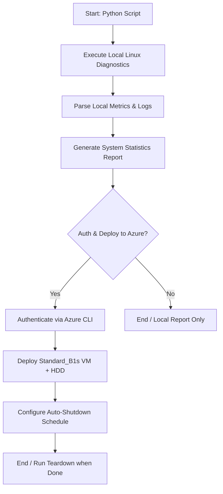

# Project 0

**Due Date** - 7/6

This is your first individual project. You are tasked with creating an SRE Diagnostic & Automated VM Deployment Tool. To ensure you understand the required workflows, review the specifications and guidelines below.

This project will require you to use technologies and automation concepts that you may have not fully come across yet but will in the early course of training. Make sure to plan ahead, and have a clear idea of what you need for the project and what you can complete with what you have learned. Do not leave this project to the end of the week.

---

## Required Technologies

* **Python** (Core application logic and script automation)
* **Bash & Linux CLI Diagnostics Tools** (`ps`, `free`, `df`, `top`, `ss`/`netstat`)
* **Git** (Version control)
* **Azure CLI** (Cloud infrastructure provisioning)
* **Azure Cloud Services** (Azure Compute & Storage resources)

---

## Preliminary Work

### GitHub Repository

* Setup a personal repository for the project on GitHub.
* Clone the repository to your computer and initialize it.
* Create your first commit on your computer.
* Complete your first push to the repository on GitHub.

### Workflow & Use Case Design

Understand what your application is meant to do by reviewing the automation workflow below:

### Glossary of Terms

#### SRE (Site Reliability Engineering)

A discipline that incorporates aspects of software engineering and applies them to infrastructure and operations problems to create highly scalable and reliable software systems.

#### Metrics & Logs

Metrics are numeric measurements (like CPU usage or available disk space) captured over time. Logs are append-only text records of discrete events that happened within a system.

#### MVP (Minimum Viable Product)

A version of a product with just enough features to be usable by early users, who can then provide feedback for future product development.

#### Teardown Routine

A cleanup script or command sequence designed to completely destroy provisioned cloud infrastructure to ensure resources are not left running unnecessarily.

---

## Required Features

### 1. Local System Diagnostics Feature

The local diagnostics module is meant to provide experience handling native OS commands from within programming languages, parsing standard text streams, and running calculations.

* **User Stories:**
* As an engineer, I can execute the tool to gather local system statistics (CPU, memory, disk utilization, and active network connections).
* As an engineer, I can parse structured or unstructured log files to extract and calculate error frequencies or trends.

* **Requirements:**
* Must utilize Python's subsystem/process execution capabilities to securely invoke Linux tools like `ps`, `free`, `df`, or `ss`.
* Output must be neatly formatted into a readable summary report.

### 2. Automated Azure Infrastructure Provisioning

The automated deployment module introduces infrastructure-as-code principles via command-line scripting, testing environmental error handling, and cloud state checks.

* **User Stories:**
* As an engineer, I can trigger a deployment flag in the tool to instantly spin up a cloud-hosted virtual machine.

* **Requirements:**
* Must dynamically interface with the **Azure CLI** to handle authentication and resource commands.
* Must strictly enforce **Zero-Cost / Free-Tier Guidelines** to avoid cost overruns.

---

## Zero-Cost / Free-Tier Guidelines

> [!IMPORTANT]
> To maintain a strictly zero-cost sandbox environment, your deployment scripts **must** conform to the following baseline configurations:

* **Compute Constraints:** Deploy VMs using the `Standard_B1s` size only, which qualifies for Azure's free credit thresholds.
* **Storage Constraints:** Explicitly attach Standard HDD disks instead of Premium SSDs to remain inside the free storage quota bounds.
* **Cost Safety Nets:** Automate an auto-shutdown policy (e.g., daily at 18:00 local time) on the target virtual machine using the `az vm auto-shutdown` extensions.
* **Teardown Lifecycle:** Execute an explicit teardown cleanup routine using `az group delete` at the conclusion of your sessions to prevent residual component charges.

---

## Extension Features

### Interactive CLI Menu

* **User Story:** As an operator, I can navigate an interactive menu terminal UI instead of typing strict command-line flags to trigger diagnostic vs. deployment states.

### Persistent Performance History

* **User Story:** As an operator, I want system metrics reports to append to a structured tracking file (like JSON or CSV) or an Azure Blob Storage container to view performance shifts over time.

### Slack/Discord Webhook Notifications

* **User Story:** As a team member, I want the tool to automatically send a summary message to a team chat channel whenever an Azure VM deployment succeeds or fails.
