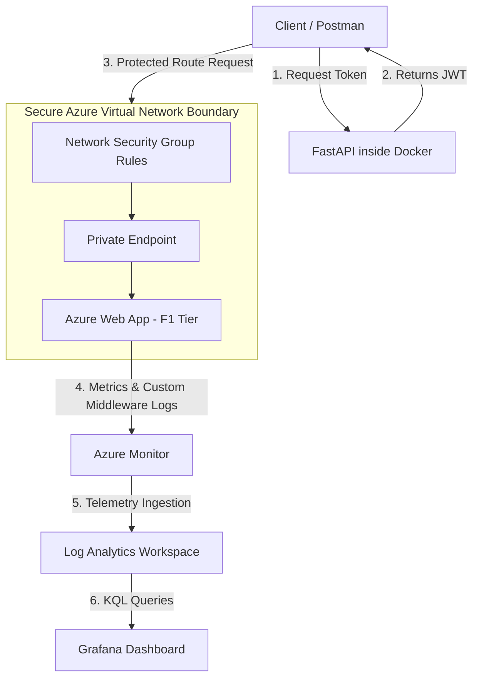

# Project 1

This is your first pair project. You and your partner are tasked with building a **Secure Microservice API & Cloud Observability Platform**. To ensure your platform is compliant, functional, and remains within the free tier, review the architecture specifications and deliverables detailed below.

This project will require you to write API code, wrap your applications in lightweight containers, construct private cloud networks, and build observability dashboards. Make sure to delegate work evenly with your partner, plan your milestones ahead of time, and continuously test your deployment pipelines.

---

## Project Specifications

* **Project Type:** Pair Project
* **Due Date:** Friday, July 24, 2026

---

## Required Technologies

* **FastAPI** (High-performance Python web framework for your core microservice)
* **Docker & WSL2** (Containerization and local integration testing environment)
* **JSON Web Tokens (JWT)** (Token-based stateless authentication)
* **Azure Web Apps** (Cloud-hosted container deployment)
* **Azure Networking** (Virtual Networks (VNets), Network Security Groups (NSGs), Private Endpoints)
* **Azure Observability** (Azure Monitor, Log Analytics, Kusto Query Language (KQL))
* **Grafana / Prometheus** (Telemetry collection and dashboard visualization)

---

## Preliminary Work

### Repository Architecture (Git)

* Establish a shared Git repository. Decide on a branching strategy (e.g., feature branching) with your partner.
* Both partners must independently commit code and push changes to ensure even contribution history.

### System Architecture

Review the secure cloud network deployment and observability pipeline before drafting your infrastructure scripts:

### Glossary of Terms

#### Microservice

An architectural style that structures an application as a collection of small, autonomous, and loosely coupled services modeled around a specific business domain.

#### JWT (JSON Web Token)

An open standard (RFC 7519) that defines a compact and self-contained way for securely transmitting information between parties as a JSON object.

#### Observability

The degree to which you can understand the internal states of a system based entirely on its external outputs (metrics, logs, and traces).

#### SLI & SLO

* **Service Level Indicator (SLI):** A quantifiable metric of the service performance (e.g., error rate, latency).
* **Service Level Objective (SLO):** A target reliability metric set for an SLI (e.g., HTTP 5xx responses must stay below 0.1%).

---

## Required Features

### 1. Secure FastAPI Core (Authentication & Middleware)

Build a robust microservice backend that implements strict user identification and standardized logging interfaces.

* **User Stories:**
* As an API user, I can register and request a short-lived JWT token by providing valid credentials.
* As a system administrator, I want all exceptions and critical request events intercepted and logged uniformly.

* **Requirements:**
* Must implement token-based authentication (JWT) for secure routes.
* Must craft custom error-logging middleware to capture application errors and route performance telemetry automatically.

### 2. Containerization & Private Networking

Isolate your application tier from the public web using container layers and restricted cloud boundaries.

* **User Stories:**
* As an infrastructure engineer, I want the application uniformly packaged so it executes identically in local test environments and cloud clouds.
* As a security engineer, I want public access to the microservice restricted via cloud-defined networking rules.

* **Requirements:**
* Write optimized Dockerfiles for the application tier.
* Configure Azure Virtual Networks (VNets), Network Security Groups (NSGs), and Private Endpoints to isolate your web applications.

### 3. Monitoring & Telemetry Dashboards

Expose internal microservice states to centralized logging platforms to proactively flag stability issues.

* **User Stories:**
* As a site reliability engineer, I can query real-time log aggregates to measure platform health indicators.

* **Requirements:**
* Hook custom middleware logs into an Azure Log Analytics Workspace.
* Construct a live Grafana or Azure Monitor dashboard tracking system SLIs and SLOs driven by Kusto Query Language (KQL) expressions.

---

## Zero-Cost / Free-Tier Guidelines

> [!IMPORTANT]
> To ensure your deployment incurs no unexpected charges, your infrastructure configurations **must** comply with these limits:

* **App Service Tiering:** Configure your Azure App Service Plan to use the **`F1 (Free)`** pricing tier.
* **Log Ingestion Thresholds:** Utilize the Azure Log Analytics Workspace free tier, which offers up to **5 GB of monthly data ingestion** for free.
* **Local Shift-Left Testing:** Run all integration tests locally inside your Docker/WSL2 workspace environment before triggering pushes to active cloud instances.
* **Cloud Budget Fuse:** Set up an initial Azure Budget alert with a hard notify ceiling limit of **$0.01** to trigger immediate notifications if billing anomalies occur.

---

## Extension Features

### Automated CI/CD Pipelines

* **User Story:** As a developer, I want my Docker images automatically built, scanned for vulnerabilities, and deployed to Azure Web Apps every time a commit lands on the main branch.

### Decentralized Secret Management

* **User Story:** As a security engineer, I want database keys and JWT encryption secrets dynamically pulled from Azure Key Vault at application startup instead of hardcoding environmental files inside my container layers.

### Automated Alerting Policies

* **User Story:** As an operator, I want an active alert to fire an email or webhook message if the API's failure rate exceeds your defined SLO thresholds for longer than 3 minutes.